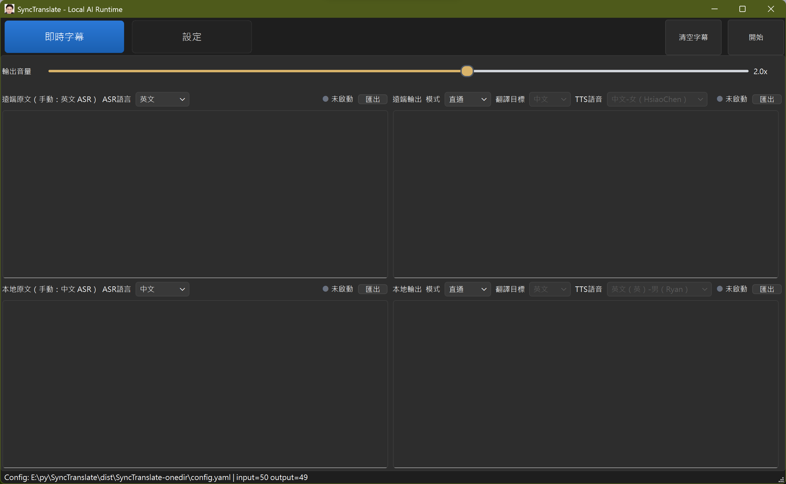
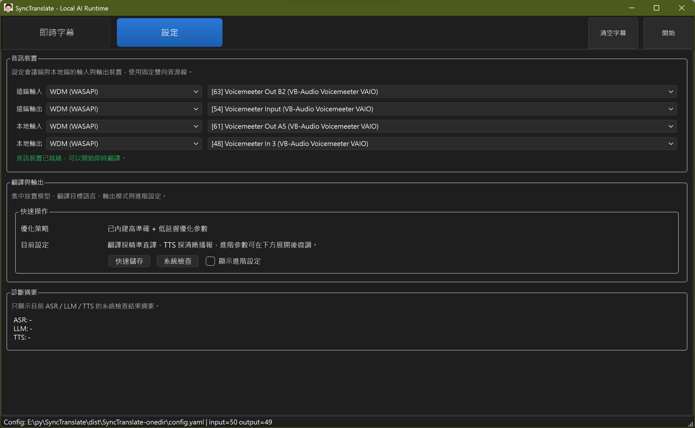

# SyncTranslate 文件導覽

## 畫面預覽





SyncTranslate 是一個在 Windows 上運作的雙向即時翻譯桌面工具，負責：

1. 擷取遠端會議音訊與本地麥克風音訊
2. 分別送入方向獨立的 ASR 與 LLM
3. 在 UI 顯示原文與翻譯字幕
4. 依每個方向的模式決定要直通原聲，還是輸出翻譯語音

## 主要畫面

- `即時字幕`
  - 顯示遠端原文、遠端翻譯、本地原文、本地翻譯
  - 每個翻譯區可切換 `直通` / `翻譯`
  - `翻譯目標` 與 `TTS 語音` 只在 `翻譯` 模式下生效
  - `輸出音量` 是共用主音量，不與模式切換綁定
- `設定`
  - 音訊裝置
  - 本地模型設定
  - 系統檢查摘要

## 最近整理

- 即時字幕頁已改成以 `channel` 為中心管理 UI 狀態。
- `remote` / `local` 共用同一套模式、目標語言、TTS 聲線與標籤刷新邏輯。
- `模式` 的設定現在會正確保存並在重新套用設定後維持，不會再被目標語言或聲線值誤覆蓋。
- `輸出音量` slider 已改成固定樣式，圓形 handle 會對齊 `0.1x` 刻度。

## 核心概念

- `remote` source
  - 來源：`audio.meeting_in`
  - 輸出：`audio.speaker_out`
- `local` source
  - 來源：`audio.microphone_in`
  - 輸出：`audio.meeting_out`

字幕面板固定為：

- `meeting_original`
- `meeting_translated`
- `local_original`
- `local_translated`

## 目前內建預設

- ASR：`large-v3`
- 執行取樣率：`48000`
- chunk：`40ms`
- pre-roll：`220ms`
- 預設輸出增益：`1.4x`
- 字幕 profile：`live_caption_fast`
- 語音 profile：`speech_output_natural`

## 常用命令

```powershell
uv run python .\main.py
uv run python .\main.py --check
uv run python -m pytest -q
```

## 相關文件

- [架構說明](./docs/架構說明.md)
- [設定說明](./docs/設定說明.md)
- [快速安裝手冊](./docs/快速安裝手冊.md)
- [測試說明](./docs/測試說明.md)
- [更新紀錄](./docs/更新紀錄.md)
- [音訊裝置建議配置](./docs/音訊裝置建議配置.md)
